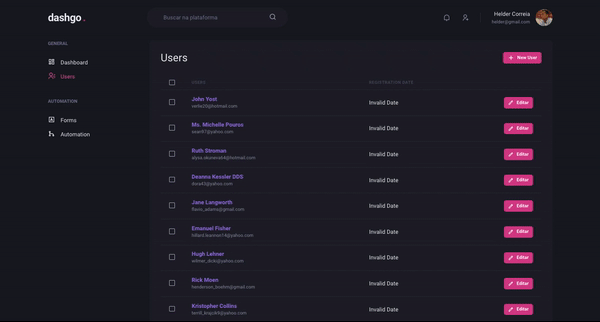

<h1 align="center">
  dashgo<span style="color: #D53F8C;">.</span>
</h1>

<p align="center">Dashboard App</p>


<p align="center">
 <a href="#about-the-project">About the project</a> •
 <a href="#technologies">Technologies</a> •
 <a href="#development-setup">Development Setup</a> •
 <a href="#License">License</a> •
 <a href="#author">Author</a>
</p>


## About the project

The project aims to study and develop an application in ReactJS with NextJS and Typescript to implement a dashboard.

The application was developed using the NextJS framework using Chakra-ui to build the interface, React-Hook-Form to manage forms, Yup to validate forms, MirageJS to simulate an API.

<div align="center">
    
   
</div>

---

## Technologies

Below the technologies used to build the application

- [ReactJS](https://reactjs.org/)
- [NextJS](https://nextjs.org/)
- [TypeScript](https://www.typescriptlang.org/)
- [Chakra-ui](https://chakra-ui.com/)
- [React Hook Form](https://react-hook-form.com/)
- [Yup](https://github.com/jquense/yup)
- [MirageJS](https://miragejs.com/)

---

## Development Setup

### **Requirements**

Dependencies:

- [Git](https://git-scm.com/)
- [Yarn](https://classic.yarnpkg.com)


### **Clone the project**

```bash
# Run the command git clone  to clone the repository 
$ git clone https://github.com/hppc25/react-dashgo.git
#  change to directory
$ cd dashgo
```

### **Setup the project**

```bash
# install dependencies
$ yarn

# serve with hot reload at localhost:3000
$ yarn dev

```

---

## License

The MIT License. Checnk [LICENSE](LICENSE) for more information.

---

## Author

By Helder Correia 👋🏽 Get in touch!

[](https://www.linkedin.com/in/helder2pc/)
[](mailto:hppc25@gmail.com)